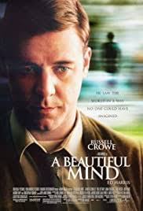
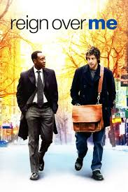

# Movies

Do you watch movies often?
I surely do.
I'm a big fan of movies and it all started when I was on my break year from school.
Then I started to watch documentaries but at some point I stopped watching because I realized that many of them were biased.
So I decided to watch artistic movies instead, because at least they were fiction.
I'm not saying there are no good documentaries out there, but at that point I was disappointed in them.

The first artistic movie that caught my attention then was [A beautiful mind](https://www.imdb.com/title/tt0268978/?ref_=nv_sr_srsg_0) about a genius who suffers from schizophrenia.
That's how I got my interest in movies with people who have some mental/physical problems.
For me it's just so fascinating to see such people, even if I know that the depictions are not 100% accurate.
These are my favorite types of movies, but I watch everything that is good, except horror.

A movie very close to my heart is [Reign over me](https://www.imdb.com/title/tt0490204/?ref_=nv_sr_srsg_0) about a man who lost his family in the 9/11 attack.
I was very impressed by Adam Sandler playing in a drama, it was the first time I've seen him in one.
The music is also very good.
The theme song is [Love, reign o'er me by Pearl Jam](https://www.youtube.com/watch?v=YO31Vgrr3oM).
This movie is just very special to me and I can't really put it into words.

