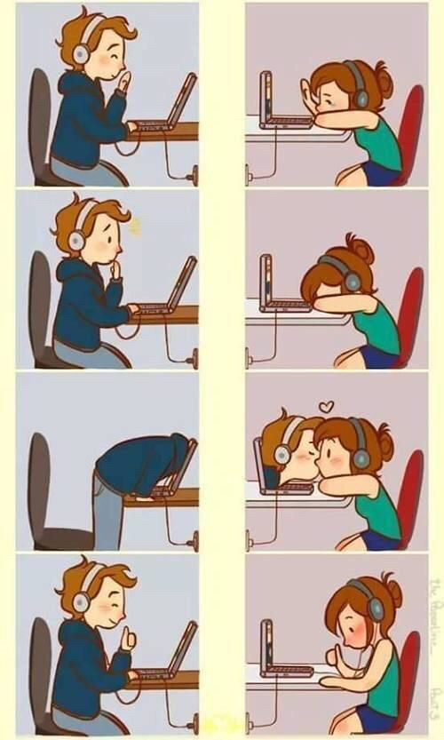
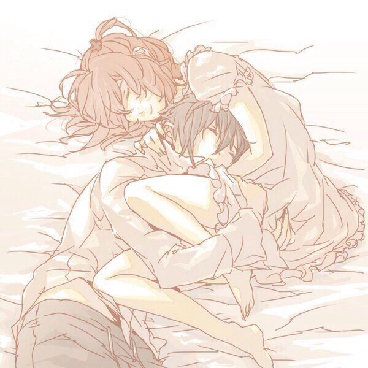

# Our love story

I really wanna write about our long distance relationship because it's a big part of my everyday life and I know that there are many people who also have this type of relationship and I hope to encourage them to be patient and stay strong.

## How it all started

I remember that after I finished high school I was always trying to practice my English in any way I could, because I didn't want to forget it.
I was doing it by chatting with strangers on different chatting platforms.
This was not a very good idea because people I met there were looking for different things, which was frustrating for me.

One day at university we had a visit from some German students and, as guests, we had to do joint activities with them.
Naturally, we were supposed to speak in English and I remember I was so anxious to speak, because even if I was constantly texting in English with people, I wasn't experienced in talking.
Many of the German students spoke so well, or it seemed to me so at the time, that I got jealous and decided I really had to do something about my English.

Then I was a second year sociology student and for the first time I started to think about the problem like a researcher.
I understood that, maybe if I narrow down my search for chats I may succeed in my goal of practicing English, so I wasn't looking just for chat sites, but for language exchange sites, which was a game changer for me.
After some searching, I found a site named *sharedlingo.com*, which unfortunately doesn't exist anymore.
There I met a lot of nice, highly educated and also polite people willing to practice all sorts of languages.
I used to chat there and if I liked them I'd share my Skype contact details to try to talk to them, which can be extremely awkward with strangers.
However, even if most people were nice, at some point I was beginning to feel frustrated because I couldn't make meaningful, lasting connections and I decided to delete my account.
But before doing so, I left some people I liked my contact details to continue chatting in Skype if they wanted.
Among those people, there was my future boyfriend.

Not long after that, I received a message on Skype saying ''Hello this is *[user name]*, I just got back from university.'' I was so amazed he received my message after I deleted my account from sharedlingo, on which we chatted very little.
But this is how it all got started.
From that moment on, we chatted every day.
And I remember that I was so nervous when first talking to him because I liked him and I was anxious about my voice because I have a speech problem and because other experiences regarding voice chatting to strangers have been awkward so far for me.
But he encouraged me and in time we got to know each other better.

## The most difficult and amazing year in my life

I met him right before I was starting my 3rd year in university, year in which I had to work on my diploma project.
Luckily, he was also on his final year at bachelor's.
So we had a lot of things in common.
During that time, my grandma was very sick and she died right before I graduated.
He was with me all the way, helping me both with my school stress and sadness caused by my grandma's condition.
He was and still is the best friend I've always wished for.
Since I met him, my health improved and so did my optimism.
I am inclined to think I couldn't have done it without him through such difficult times.

## The first time we met

We were already chatting daily for more than 3 months, when after spending New Year's Eve together, he first told me he wanted to visit me.
I was happy but I thought it was a bit too early for that.
Anyway, he couldn't do it right away because he didn't have money at that time and he still had school and so did I.
So, we had to wait 8 more months for it to happen.
By then, we were already finished with university work.
After almost 11 months since that first message in Skype, we finally met.
I remember I had to meet him in a frontier town, far from mine and I told him I can't come there alone because of my disability and that mom would have to come with me but he didn't mind.
I was so happy that he accepted me the way I was.
And during his first visit everything was so unforgettable from the first kiss and first night in a random hotel from a city far away to spending time with him at home or visiting places in my town.
I find it funny that, even if my town has a lot to offer, being a touristic attraction, the place he liked the most was a park quite close to home.
After that, he visited me 3 more times, but that was the best visit from all.

## And the story goes on

When people ask for how many years we have been together, I guess by together they mean romantically involved, but we are counting ever since that first message on Skype, because we have always been together everyday ever since and romantic feelings came naturally after a while.
In fact, to be honest, I don't even remember when he said he loved me for the first time, because everything developed so naturally.
We have a romance based on a solid friendship.
We have been together for more than 4 years now and we continue fighting for our relationship, hoping to bring it offline for an indefinite period of time.
Unfortunately, because of the 2020 pandemic we aren't able to see each other for now, but we are trying to stay strong.
I owe to my boyfriend writing this blog, because he strongly supported me in doing so and I love him very much for it and for everything else he's doing for me.
