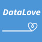

# Working remotely

Since the 2020 pandemic started, many people began to work remotely.
All my jobs so far were remote, even before the pandemic, because I have a disability that limits my movements.
Going to work would be not only tiring, but also expensive for me, as I would have to go by taxi which is not reliable during the rush hours.
So after finishing university I started looking for a job with that in mind.
Let me tell you about the working experience I've had so far.

## Working for a YouTube channel

I landed my first job relatively fast, after a few weeks of searching.
It was my first application for a job ever sent.
My job involved searching for statistical data for a YouTube channel called [DataLove](https://www.youtube.com/channel/UCkog-t_Pp4UyaC1x8-mGWag/featured).
Our videos were called "bar chart races", as they show how statistical data on some subject changes over time.
This job proved to be much more difficult than I thought because I didn't only have to search for data and put it in a specific format, but I also had to make the actual video myself.
However, putting large amounts of data together from different sources in a specific format was the most difficult thing I had to do.
I was lucky that my boyfriend helped me a lot, morally and technically.

I don't wanna bore you with the technical details, but rather I'm going to tell you how it felt for me to work like this.
At first I felt stressed and overwhelmed of what I had to do and I could barely sleep at night.
I was lucky that my boss didn't add to that stress.
He was actually a nice guy as he was friendly and always paid on time.
I got hired at the end of October 2019 and only in the beginning of January 2020 I started to feel better about my job.
At that time, I was also given my own channel, on which only I uploaded videos.
On DataLove all the employees were uploading their videos, so the channel didn't have a homogeneous look.
So, I was happy to get my own channel.
My channel is called [DataLove Bar Chart Races](https://www.youtube.com/channel/UC6b4kBQJUCspokKxtRpG38g).
I am very proud of it, because I've put a lot of work into it.
My boyfriend has helped me with the data a lot, for which I'm grateful.
Just as the things were starting to get better for me, my boss decided to stop the project entirely, because he realized it won't be profitable.
In a way, I was relieved because I was very tired but at the same time I was also very sad because I got attached to my work.

On this 3 months job I realized working from home can be very stressful and tiring because you are alone, and you have to solve everything by yourself, or at least this is how my job was.
I also felt very lonely, but I was lucky to have my boyfriend who'd always be there for me.
I just wish I wouldn't have stressed anyone around me, that's all.
From what I heard from a friend, working in the office is better because your colleagues support you and the pressure you feel is not so high.

## Working as a transcriber

Soon after I lost my job, I was contacted by one of my university teachers who asked if I'd like to help by being a participant in some research, which I was happy to do, because my teachers are nice people.
I met him at the university and we talked a bit.
That's how he found out that I have some experience transcribing research interview both from my own research and from volunteering, so he told me he has some interviews he'd pay me to transcribe.
I was really happy about it, because I enjoy transcribing for the stories I leiaten to while doing so.
But some weeks after that, the pandemic started and he told me he was unsure if in those conditions the university would still pay for my services.
I was upset but I understood the situation.
After some time, I started volunteering at 7cups as a translator of the site in my native language.
I thought it would be a good experience to see if I'd like to do translations as a job in future.
Surprisingly before Easter, my teacher emailed me to ask if I'm still interested in transcribing the interviews and of course I said yes.
So I started transcribing at my own pace, which was very nice.
Everything took me approximatively 2 months and I was honestly enjoying it, at least most of the time.
With this occasion I found out that maybe I'd be happier with a part time job.

## Searching for a new job

Since then searching for a new job has proven more difficult than I anticipated, because there are not many jobs I'm qualified to do because I'm inexperienced and I have a nontechnical degree.
For now I'm focusing exclusively on remote jobs, but after the pandemic, I'm taking into consideration going to an office because I've been isolated ever since I finished university and I'm so tired of it.
I know I shouldn't give up on searching but it's so difficult to keep going, especially now that I have a health problem on top of my disability.
In the future I'll make an update for this post where I'll talk about my next job experiences.
